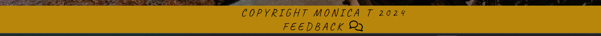
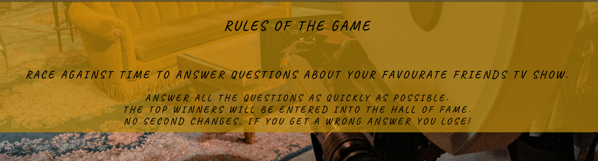
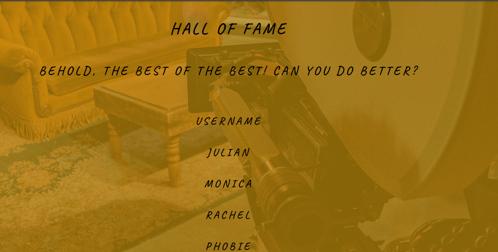
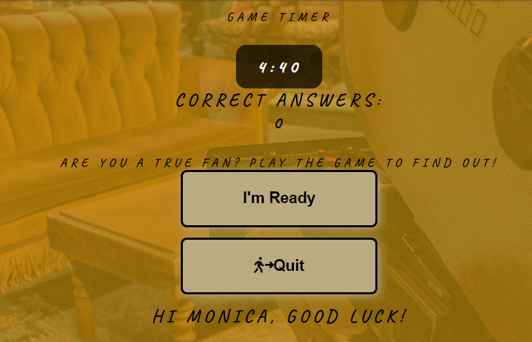
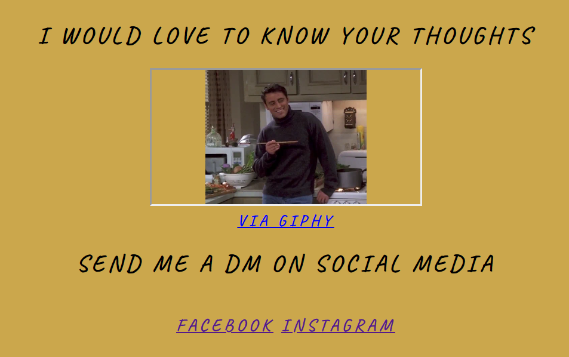
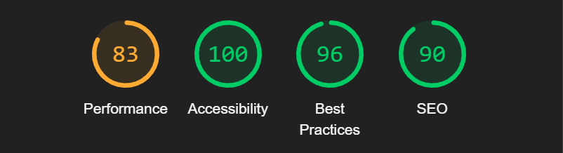

<h1>Friends Quiz</h1>

This Friends Quiz website is a simple easy way to keep users entertained while pasting time with a Challenging quiz, based on the TV show Friends. 
Users can test their knowledge of the show and characters against a 5 minute timer. The site is targeted toward fans of the TV show and people who think they show buffs. 
The game is perfect for someone with a short amount of time to kill or people who are looking for an easy going short distraction.

<h2>Features</h2>
<h3>Navigation</h3>

Featured at the top of the page, the navigation bar shows the site name: FRIENDS QUIZ that links to the home page. Other navigation links on the right, comprises of a menu with all the page links; Home, Rules, Hall of Fame and Play. The font is in a style that compliments the title and is like the font used on the Friends TV show. The title font is in a similar style of the TV show, with the dots in between the letters. This is to create a familiar feel to the TV show itself. I designed the navigation bar to be responsive to screen size and easy to use.

<h3>The Header</h3>

The home page header is clear on what this webize is and what it is for. From here users can navigate to the rules, hall of fame or play the game.

<h3>The Footer</h3>

The footer was designed to be clear and simple. It is made up of a link to provide feedback and copyright information.

<h3>Rules</h3>

The rules page is so the user knows what to expect when playing the game.
 

<h3>Hall of Fame</h3>

Is a simple board with the best payers listed.

<h3>Play</h3>

The play page has a simple layout. It has a timer so the user can see how much time they have to answer all the questions. 
The buttons are reactive and help the user engage with the site by adding a username. Once entered, a personalised message shows, wishing the user luck. The timer will start and the first question with answer options will appear below. 
When time timer ends, an alert pops up to say, ‘times up’ and signals the game is over. The user is then taken to the Rules page. If the user completes the game, a congratulations message shows and takes the user to the Feedback page.

<h3>Feedback</h3> 
The feedback page has a fun Gif fans of the TV show will understand. It is in theme with asking how the user is feeling about the quiz. I put in links to Facebook and Instagram so if the user would like to get in touch and share their thoughts they can. The links open up in a new tab, so they don’t need to find the URL of the quiz again.

<h2>Testing</h2>
I have tested the site on different browsers; Chrome, Safari, Microsoft Edge.
I can confirm that the project is responsive, looks tidy and functions on all standard screen sizes using the devtools device toolbar.
The navigation, header, hall of fame, rules, play and feedback text are all readable and easy to understand. I had multiple people text the website and play the game on different devise types and screen sizes. The overall feedback was as follows: The design of the website is easy to understand and how to play the game. Most people found it addictive and wanted to finish the questions and played multiple times before completing the quiz. 

<h2>Bugs</h2>
<h3>Solved bugs / Unsolved bugs</h3>
When I deployed my project to GitHub, there was an issue with my one of my CSS classes. I couldn’t understand or solve the problem. So, I have to use a different class to make sure the text was positioned right so it was visible.  This solved the problem, but not the root cause of the original bug. 

<h2>Validator Testing</h2>
HTML – No errors were found when passing through the official W3C validator.
CSS – No errors were found when passing through the official (Jigsaw) validator.
JavaScript - passed with no significant issuess using JShint.
Accessibility – Colours and fonts are easy to read and accessible. The performance is slowed down due to the background image. I did reduce the size of the photo and this improved the performance score. I confirmed this by running through lighthouse in devtools.

<h2>Deployment</h2>
The site was deployed to GitHub pages. The steps to deploy are as follows:
<ul>
<li>In the GitHub repository, navigate to the 'settings' tab.</li>
<li>From the menu on the left, navigate to 'pages'.</li>
<li>Within 'pages', under 'Build and Deployment' the source should be 'Deploy from a branch'.</li>
<li>Underneath, the branch should be set to 'main' and the file 'root'.</li>
<li>Now click 'save'. The website is being deployed.</li>
<li>Click on the 'code' tab of your repository </li>
<li>On the right, find Environments and click 'GitHub-Pages'.</li>
<li>From the new open page, click 'view deployment'.</li>
</ul>

The live link can be found here – <a href="https://monicathomas8.github.io/quiz-game-p2/"  target="_blank">FRIENDS QUIZ</a>

<h2>Credits</h2>
Content – the content, idea and code to make the project was created be myself. I had help with building the structure of some functions in my code and problem solving with my peer George Small. I also use Kevin Powell on YouTube to help problem solve.

<h2>Media</h2>
I used the following: 
Font Awesome for some fun icons.
Google Fonts to create a Friends TV show feel. 
I used Pexels for the one image of the Friends TV set. The link is here:
Photo by Clément Proust from Pexels: https://www.pexels.com/photo/studio-warner-de-la-serie-tv-friends-15700348/
	
<h2>Final Thoughts / Future Development</h2>
If I had more time, I would of liked to linked the user score to the Hall of Fame scoreboard, along with their time.  I also would of like to have more pop art style pictures for the background. However, they were not free to download. I would of like to have more questions and created a random loop. But it throws up a few bugs and I was short on time to problem solve. Overall, I am pleased with the outcome and the feedback I have had is positive and testers found the game addictive and entertaining. I hope you find it enjoyable, thank you.
 -Monica. 
